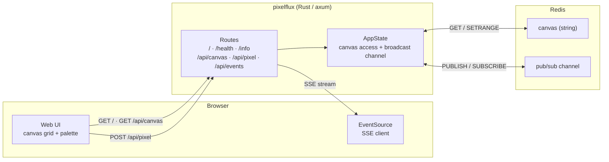
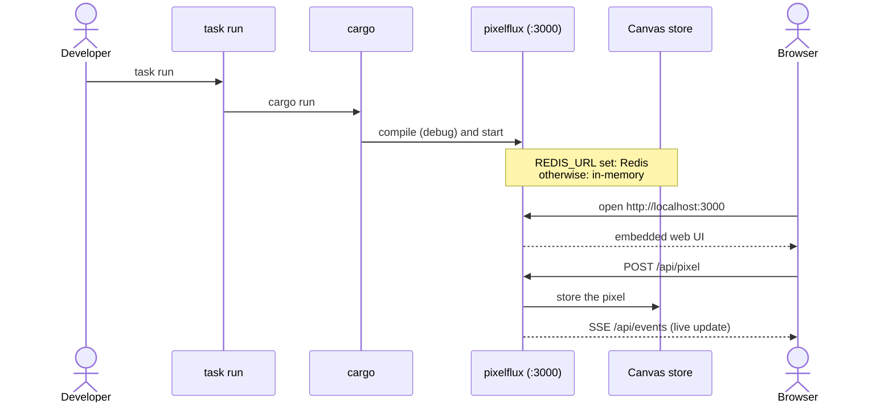
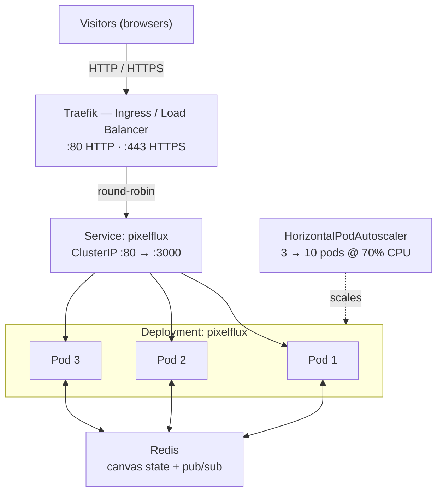
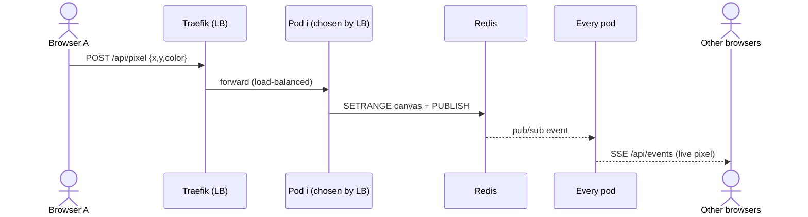

<h1 align="center">Pixelflux</h1>

<p align="center">A real-time, multiplayer pixel canvas in Rust — with a full production pipeline.</p>

<p align="center">
  
  
  
  
</p>

## What it is

A shared **64×64 pixel canvas**: pick a colour, click to paint, and everyone
sees the pixels appear live. The canvas lives in Redis (so it's shared across
instances) and updates are pushed over Server-Sent Events. With no Redis it
falls back to an in-memory canvas, so it runs with zero dependencies.

The app itself is small — the point of the project is the tooling around it:
a one-command dev shell, a tiny distroless container (< 20 MB, 0-CVE target),
automated tests and security scans, and a Kubernetes deployment.

## Architecture

A single Rust binary (axum) serves the embedded web UI and the API. The canvas
lives in Redis — shared across instances — and real-time updates are pushed to
browsers over SSE, fanned out between instances with Redis pub/sub. Without
Redis it falls back to an in-memory canvas.



## Quick start

Needs [Nix](https://nixos.org/download) (with flakes) and Docker or Podman.

```bash
nix develop          # enter the dev shell (provides every tool)
task lock            # generate Cargo.lock (first time only)
task run             # open http://localhost:3000
```

Run `task` with no arguments to see all available tasks (build, test, lint,
container, sbom, cve, deploy, …).

For the shared, persisted canvas, run a Redis alongside:

```bash
docker run -d -p 6379:6379 redis:7-alpine
REDIS_URL=redis://localhost:6379 task run
```

### What `task run` does



## What the project delivers

The goal of TP4 is to wrap a small app in a complete, production-grade
pipeline. Here is how each requirement is met.

**1. A single static binary.** The Rust app compiles to a fully static
`musl` binary (no libc, no dynamic loader). → `task build:static`

**2. A reproducible dev shell.** A Nix flake provides _every_ tool the project
needs. A new contributor clones, runs one command, and can build — nothing
else installed on their machine. → `nix develop` (or `direnv allow`)

**3. A task runner.** [go-task] exposes every action; running it with no
arguments lists them all. → `task`

**4. A distroless container.** Built by Nix: the image contains only the
static binary (no shell, no package manager), runs as a non-root user
(uid 65532), and stays **under 20 MB** with a **0-CVE** target.
→ `task container`, `task container:size`, `task container:inspect`

**5. Git hooks.** [lefthook] runs before every commit: formatting (treefmt),
linting (clippy), and secret detection (gitleaks); commit messages must follow
Conventional Commits; tests run before push. → `task hooks:install`

**6. Supply-chain security.** Secret scanning (gitleaks), SBOM generation
(Syft), and CVE scanning (Trivy) are all automated tasks.
→ `task secrets`, `task sbom`, `task cve`

**7. Testing at multiple levels.** Unit tests (in-memory), integration tests
against a **real Redis** via Testcontainers, API contract tests (Hurl +
OpenAPI), and load/benchmark tests (k6).
→ `task test`, `task test:integration`, `task test:api`, `task bench`

**8. A CI pipeline.** GitHub Actions runs three jobs — quality (lint, format,
secrets), tests (build, unit, integration), and container (build, size check,
SBOM, CVE scan) — all inside `nix develop`, so CI and local use the same
toolchain. The build fails if any check fails.
→ [`.github/workflows/ci.yml`](.github/workflows/ci.yml)

**9. Linters and formatters.** [treefmt] formats every file type at once
(rustfmt, taplo for TOML, nixpkgs-fmt, shfmt, prettier), plus clippy,
shellcheck, yamllint, actionlint, and markdownlint. → `task fmt`, `task lint`

## Tech stack

Rust ([axum]) · [Nix] flake (dev shell + container) · [go-task] · [lefthook] ·
[treefmt] · [gitleaks] · [Syft] / [Trivy] · [k6] · [Testcontainers] ·
[GitHub Actions] · Redis · Kubernetes + [Traefik]

[axum]: https://github.com/tokio-rs/axum
[Nix]: https://nixos.org/
[go-task]: https://taskfile.dev/
[lefthook]: https://lefthook.dev/
[treefmt]: https://github.com/numtide/treefmt
[gitleaks]: https://gitleaks.io/
[Syft]: https://github.com/anchore/syft
[Trivy]: https://trivy.dev/
[k6]: https://k6.io/
[Testcontainers]: https://testcontainers.com/
[GitHub Actions]: https://github.com/features/actions
[Traefik]: https://traefik.io/

## API

| Method | Route         | Description                         |
| ------ | ------------- | ----------------------------------- |
| GET    | `/`           | Web UI                              |
| GET    | `/health`     | Liveness probe                      |
| GET    | `/info`       | Name, version, and serving instance |
| GET    | `/api/canvas` | Whole canvas                        |
| POST   | `/api/pixel`  | Paint a pixel `{x, y, color}`       |
| GET    | `/api/events` | Live pixel stream (SSE)             |

## Deploy (Kubernetes + Traefik)

### Architecture

Traefik load-balances incoming requests across the app pods (round-robin via the
Service); the HorizontalPodAutoscaler adds or removes pods under load. Every pod
shares the same canvas through Redis, and real-time pixel updates are fanned out
to all pods with Redis pub/sub.



Whichever pod serves a painted pixel, it reaches every connected browser:



Runs several replicas behind Traefik; the canvas is shared via Redis and
real-time updates propagate with Redis pub/sub. On a single-node **k3s** host:

```bash
task deploy:k3s-install               # once: install k3s + Traefik
task deploy                           # build, import, apply the app, roll out
```

Then expose it — pick **one** (each defines the same route):

```bash
# HTTP
DOMAIN=your.domain.com task deploy:ingress

# or HTTPS with an automatic Let's Encrypt certificate (needs ports 80 + 443)
DOMAIN=your.domain.com ACME_EMAIL=you@domain.com task deploy:tls
```

After enabling HTTPS, use `task deploy:restart` (not `task deploy`) for code
changes, so the HTTPS route is preserved. Other helpers: `task deploy:status`,
`task deploy:logs`, `task deploy:down`. Manifests are in [`k8s/`](k8s/).

## Documentation

- [CONTRIBUTING.md](CONTRIBUTING.md) — dev setup, git workflow, running the tests
- [AGENTS.md](AGENTS.md) — instructions for AI agents and contributors
- [Architecture Decision Records](docs/adr/) — why the key choices were made
- [api/README.md](api/README.md) — API endpoints and contract tests
- [k8s/README.md](k8s/README.md) — Kubernetes manifests and deploy flow
- [argocd/README.md](argocd/README.md) — GitOps with Argo CD
- [load/README.md](load/README.md) — k6 load tests
- [SECURITY.md](SECURITY.md), [CHANGELOG.md](CHANGELOG.md), [CODE_OF_CONDUCT.md](CODE_OF_CONDUCT.md)

## License

[MIT](LICENSE) © Vallsp
