<!-- _class: lead -->
<!-- _paginate: false -->

# PixelFlux

**Un canevas de pixels collaboratif en temps réel — avec un SDLC de production complet.**

Rust · axum · Redis · SSE · Nix · Kubernetes · GitOps

<!-- Note : pitch en une phrase — PixelFlux est un petit canevas de pixels multijoueur, mais l'essentiel est le pipeline de production autour : builds reproductibles, tests en couches, analyse de la supply chain, delivery en GitOps et documentation vivante. Plan de l'exposé : montrer l'application en marche, puis expliquer comment elle est construite, testée, sécurisée, livrée et documentée. -->

---

# De quoi s'agit-il

- Un **canevas de 64×64 pixels** multijoueur : on choisit une couleur, on peint une case, tout le monde la voit aussitôt.
- Back-end **Rust / axum** ; le canevas vit dans **Redis** ; mises à jour en direct via **Server-Sent Events**.
- Volontairement minimal — l'application est le prétexte, **le pipeline d'ingénierie est le sujet**.
- Un seul dépôt contient tout : code, infrastructure, documentation et ces slides.

<!-- Note : Les fonctionnalités sont volontairement réduites pour que rien ne détourne l'attention de l'ingénierie. Une grille 64×64, seize couleurs, une synchro en temps réel. En gardant le domaine trivial, ce qui est évalué, c'est le build system, les tests, les analyses de sécurité et le pipeline de delivery. -->

---

<!-- _class: lead -->

# Démo

### Bascule vers l'application en direct →

## [ik-clicker.com](https://ik-clicker.com)

Essayez-le : peignez · synchro en temps réel · le pied de page (version + pod)

<!-- Note : Inviter le public à ouvrir ik-clicker.com sur leur téléphone pour peindre en même temps — la synchro à plusieurs est plus parlante en direct. Basculer sur le navigateur, l'application déjà ouverte. Déroulé : (1) deux onglets côte à côte ; (2) peindre dans l'un, le pixel apparaît instantanément dans l'autre ; (3) pointer le pied de page : la version vient du build, et l'identifiant du pod change à chaque rafraîchissement car Traefik load-balance sur trois réplicas. Plan B si le réseau flanche : une capture d'écran. Puis revenir aux slides. -->

---

# Architecture

```text
Navigateur ──HTTP──▶  axum  ──┐
   ▲                          ├──▶  Redis   (état du canevas + pub/sub)
   └────SSE──────── axum ◀────┘
        chaque réplica s'abonne ; les modifications sont diffusées à tous les clients
```

- **Front-ends stateless** — n'importe quel réplica sert n'importe quelle requête ; scaling horizontal simple.
- **Redis** est à la fois la source de vérité _et_ le bus d'événements.

<!-- Note : Les serveurs axum ne conservent aucun état, donc ils scalent horizontalement sous un autoscaler. Tout l'état du canevas et tous les événements transitent par Redis : une requête de peinture écrit le pixel et publie un événement, chaque réplica y est abonné et le pousse à ses propres navigateurs. C'est ainsi qu'une peinture sur le pod A atteint un spectateur sur le pod B. -->

---

# Modèle de données et API

- Canevas = **4096 cases**, chacune un index 4 bits dans une **palette de 16 couleurs**, stockées dans Redis.
- Une surface HTTP réduite et explicite :
  - `GET /api/canvas` — snapshot complet · `POST /api/pixel` — peindre une case
  - `GET /api/events` — flux **SSE** des modifications en direct
  - `GET /health` · `GET /info` — nom, version, instance
- L'interface est un unique `index.html` embarqué — sans bundler, sans framework.

<!-- Note : Le canevas est minuscule, donc un snapshot coûte peu : un nouveau client récupère /api/canvas une fois, puis suit /api/events pour les deltas. /info expose la version et l'identifiant du pod affichés dans le pied de page. Le front-end est volontairement un seul fichier HTML embarqué : cela garde le conteneur léger et l'application facile à auditer. -->

---

# Fan-out en temps réel

- **SSE, pas WebSockets** (ADR 0004) : un flux unidirectionnel serveur→client suffit.
- Il circule en HTTP simple, se reconnecte tout seul et traverse proprement les proxys.
- Une peinture : `POST /api/pixel` → écriture Redis → **publish** → chaque réplica → SSE vers ses clients.
- Les clients nouveaux ou en retard **se resynchronisent** via un `GET /api/canvas` complet.

<!-- Note : L'application ne fait que pousser du serveur vers le client, donc SSE convient mieux que WebSockets — plus simple, compatible avec les proxys et capable de se reconnecter seul. Le pub/sub de Redis est ce qui rend le multi-instance correct : sans lui, une peinture n'atteindrait que les clients du même pod. Le choix est documenté dans l'ADR 0004. -->

---

# Builds reproductibles avec Nix

- `nix develop` → **toute la toolbox**, figée et identique sur chaque machine et en CI.
- Fini le « ça marche chez moi » : compilateur, linters, scanners, k6, mdBook — tout vient du flake.
- Verrouillé de bout en bout : **`flake.lock`** (outils) et **`Cargo.lock`** (crates).
- Un point d'entrée unique pour les actions : **`task`** (go-task) — `build`, `run`, `test`, `deploy`, …

<!-- Note : La reproductibilité est le socle sur lequel tout repose. Le flake Nix fige chaque outil à une version exacte, donc un portable et le runner de CI buildent de la même façon. `task` se place au-dessus comme une liste de commandes lisible. Rien dans le projet ne dépend d'un outil installé globalement. -->

---

# Conteneur distroless

- Image **buildée par Nix**, pas par un Dockerfile — couches déterministes, aucune dérive.
- **Distroless et non-root** (ADR 0002) : ni shell, ni gestionnaire de paquets, surface d'attaque minime.
- **Moins de 20 Mo**, garanti par un size gate en CI qui fait échouer le build s'il grossit.

<!-- Note : Le conteneur sort du même flake, il n'y a donc pas de Dockerfile distinct qui se périme. Distroless signifie qu'il n'y a littéralement ni shell ni gestionnaire de paquets à l'intérieur, ce qui retire l'essentiel de ce qu'un attaquant utiliserait, et il tourne en utilisateur non-root. Un check de CI échoue dès que l'image dépasse 20 Mo, ce qui nous oblige à rester sobres. -->

---

# Tests — quatre niveaux

- **Unitaires** — logique pure du canevas (`cargo test --lib`).
- **Intégration** — contre un **vrai Redis** via Testcontainers (ADR 0003).
- **Contrat d'API** — **Hurl** sollicite les vraies routes HTTP.
- **Charge** — **k6** : smoke + throughput sur un build de release.

<!-- Note : Chaque niveau attrape une classe de bugs différente. Les tests unitaires couvrent la logique ; les tests d'intégration démarrent un vrai Redis dans un conteneur pour ne pas mocker la dépendance la plus risquée ; Hurl valide le contrat HTTP de bout en bout ; k6 donne un premier signal de performance. Les quatre s'exécutent via `task`, et les trois premiers tournent en CI. -->

---

# Intégration continue

Chaque push et chaque PR passent par le **même `nix develop`** sur GitHub Actions :

- **quality** — check du format, clippy, secret scan
- **test** — build, unitaires, intégration
- **container** — build, size gate, SBOM, scan CVE, publish sur GHCR
- **docs** / **deploy-docs** — build, prose, liens → GitHub Pages

<!-- Note : La CI réutilise l'environnement de développement exact, donc un pipeline vert signifie que le projet marche vraiment, pas qu'il marche dans une image de CI sur mesure. Les jobs reflètent le gate local. Le job container verrouille la qualité et, sur main, publie l'image que la production récupère. Docs et slides se déploient sur Pages depuis le même run. -->

---

# Sécurité de la supply chain

- Runtime **distroless, non-root** — surface minimale.
- **SBOM** avec **Syft** ; image scannée par **Trivy** — le build **échoue sur HIGH/CRITICAL**.
- **Secret scanning** avec gitleaks, en CI et dans le hook pre-commit.
- **Tout est pinné** — `flake.lock`, `Cargo.lock`, et l'image déployée par **digest**.

<!-- Note : La supply chain est traitée comme une priorité. On produit un SBOM, on scanne l'image pour les CVE connues et on bloque les plus graves, et on cherche les secrets commités en local comme en CI. Comme les crates, les outils et même le digest de l'image en production sont pinnés, ce qu'on teste est exactement ce qu'on livre. -->

---

# Delivery en GitOps

- **Argo CD** synchronise en continu le cluster avec git — le dépôt est la source de vérité.
- **Image Updater** surveille GHCR et déploie les nouvelles images **par digest** — sans déploiement manuel.
- **Aucun secret** : dépôt et image publics ; le write-back patche l'application via l'API Kubernetes.
- Tourne sur **k3s + Traefik**, HTTPS via Let's Encrypt, auto-scaling par un **HPA**.

<!-- Note : La delivery est en mode pull. Je pousse sur main, la CI publie une nouvelle image, et Image Updater repère le nouveau digest et met à jour l'Application Argo, qui déroule le déploiement — je ne lance jamais kubectl apply à la main. Aucun identifiant n'est nécessaire car tout est public et le write-back utilise le RBAC interne au cluster. Les mêmes manifests montent le TLS et l'auto-scaling. -->

---

# Architecture Kubernetes



- **Traefik** route le trafic HTTP/HTTPS vers le **Service**.
- Le **Deployment** tient 3 réplicas stateless ; l'**HPA** monte jusqu'à 10.
- Chaque pod dialogue avec **Redis** (état + pub/sub).

<!-- Note : Voici la topologie de déploiement. Le trafic entre par Traefik, qui termine le TLS et load-balance en round-robin sur le Service. Le Service vise les trois pods du Deployment ; le HorizontalPodAutoscaler ajoute des pods jusqu'à dix selon la charge CPU. Comme les pods sont stateless, ils dialoguent tous avec Redis, qui détient l'état du canevas et le bus pub/sub — c'est lui qui synchronise les instances. -->

---

# La documentation comme du code

- Manuel **mdBook**, publié sur **GitHub Pages** à chaque push sur `main`.
- Des **ADR** consignent le _pourquoi_ de chaque choix — Nix, distroless, SSE, Redis, Kubernetes.
- Prose vérifiée par **Vale**, liens par **lychee**, en CI — la doc ne peut pas pourrir en silence.
- Une seule source de vérité : le site est généré depuis le Markdown du dépôt — ces slides comprises.

<!-- Note : La documentation vit à côté du code et passe par le même pipeline, elle ne peut donc pas dériver. Les Architecture Decision Records expliquent les compromis, ce qu'un évaluateur veut généralement voir. Même ce deck est du Markdown dans le dépôt, rendu par Marp et publié sur Pages à côté du manuel — c'est l'idée du « slides as code ». -->

---

# Qualité du code et garde-fous

- **clippy** avec `-D warnings` — un warning fait échouer le build.
- **treefmt** formate chaque langage avec une seule commande (rustfmt, prettier, shfmt, …).
- **Conventional Commits**, imposés par un hook `commit-msg`.
- Hooks **lefthook** : pre-commit (format, lint, secret scan), pre-push (build, test).

<!-- Note : Les garde-fous font du bon chemin le chemin par défaut. On ne peut pas commiter du code non formaté ni un message non conventionnel, et on ne peut pas pousser quelque chose qui ne build pas ou casse les tests unitaires. clippy bloque le build : une erreur, pas un simple conseil. Résultat : un code et un historique cohérents sans compter sur la mémoire. -->

---

# La suite

- **Auth et rate-limiting** — aujourd'hui n'importe qui peut peindre ; ajouter une identité et des limites contre les abus.
- **Historique durable** — capturer et rejouer le canevas au-delà de l'état vif de Redis.
- **Observabilité** — métriques et tracing le long du chemin SSE / Redis.
- Périmètre assumé : ce sont des omissions délibérées, pas des oublis.

<!-- Note : Annoncer franchement les limites est plus convaincant que de prétendre qu'il n'y en a pas. L'application n'a pas d'auth, c'est donc un canevas ouvert par conception ; la persistance se limite à Redis ; et il n'y a pas encore de stack de métriques. Aucun de ces points n'est difficile à ajouter vu le pipeline déjà en place — ce n'était simplement pas le but de l'exercice. -->

---

<!-- _class: lead -->

# Merci

**Dépôt** · `github.com/Vallsp/PixelFlux`
**Docs** · `vallsp.github.io/PixelFlux`
**Slides** · `vallsp.github.io/PixelFlux/slides`

_Des questions ?_

<!-- Note : Conclusion — l'idée à retenir est qu'une petite application peut tout de même démontrer un SDLC complet et de qualité production. Montrer le dépôt, la doc et les slides en ligne, puis ouvrir la discussion. Sujets probables : pourquoi SSE plutôt que WebSockets, pourquoi Nix, et comment la boucle GitOps évite les secrets — chacun a un ADR ou une slide derrière. -->
